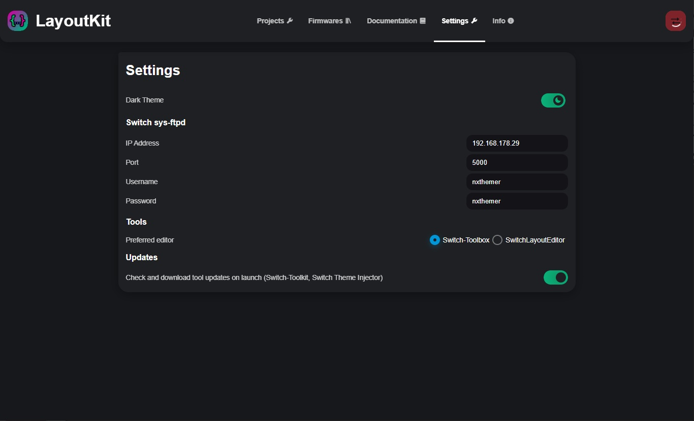

# **LayoutKit** 📦

<p align="center">
  
</p>
<h1 align="center">Welcome to LayoutKit!</h1>
<p align="center">
LayoutKit is a tool that makes it easier to create Nintendo Switch layouts.
</p>
<p align="center">
    <a href="https://ko-fi.com/Q5Q47KAM3"></a>
</p>

## **Features** 📝

- Easy project environment management
- Easily and visually edit files in Switch-Toolbox or SwitchLayoutEditor
- Import and export layout json files using Switch Theme Injector
- Wirelessly transfer menu files to the Switch over FTP
- Automatically push files after changes were made
- Reboot the Switch via the desktop application

## **How to use** ✋

### **Requirements**

- Windows

### **Steps**

1. Download the latest release from the [releases page](https://github.com/ThemezerNX/LayoutKit/releases).
2. Follow the steps in [LayoutDocs](https://layoutdocs.themezer.net/guide/).

## **Included in this kit** 📜

- [Switch Toolbox](https://github.com/KillzXGaming/Switch-Toolbox) by @KillzXGaming
- [SwitchLayoutEditor](https://github.com/FuryBaguette/SwitchLayoutEditor) by @FuryBaguette and @exelix11
- [Switch Theme Injector](https://github.com/exelix11/SwitchThemeInjector) by @exelix11

## **Screenshots** 🖼️

### **Projects**


### **Firmwares**


### **Settings**



## **Build Commands** 💻

``` bash
# install dependencies
yarn
yarn global add electron-icon-builder

# serve app with hot reload
yarn run dev

# build electron application for production
yarn run build
```

## **Special Thanks** ❤️

Special thanks to the awesome people who created the awesome tools above!

---

This project was generated with [electron-nuxt](https://github.com/michalzaq12/electron-nuxt) v1.7.0
using [vue-cli](https://github.com/vuejs/vue-cli). Documentation about the original structure can be
found [here](https://github.com/michalzaq12/electron-nuxt/blob/master/README.md).
